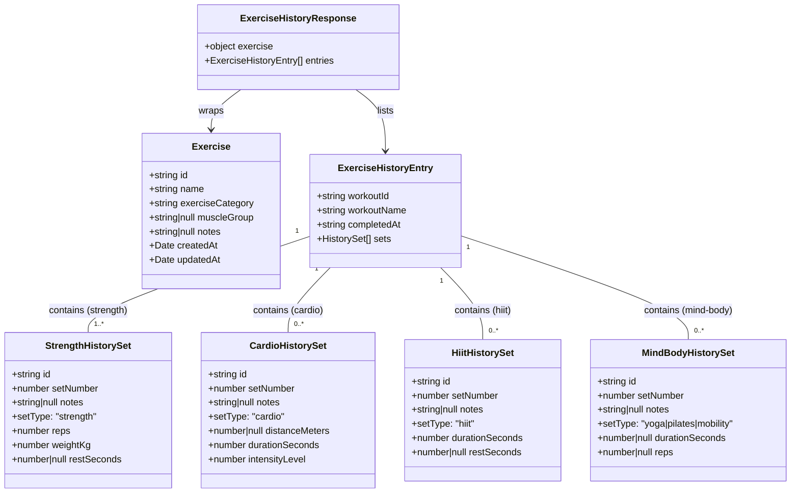

# Exercise History with Line Graph

## Requirements

Implement a dedicated exercise history feature that enables users to search for any exercise and view a chronological record of every time they performed it across completed workouts. Surface performance progression visually through a responsive line graph (e.g., max weight, distance, or duration per session) alongside a full tabular set breakdown, lowering the cognitive load of identifying improvement trends.

---

## Entities



---

## Approach

1. **API Layer**:
   - Add `GET /api/exercises/:exerciseId/history` to the existing `exerciseRouter`, following the clean architecture pattern used for workouts, plans, and templates
   - The new route is registered **before** `GET /:id` to prevent `/history` being matched as the `id` parameter
   - Route handler instantiates concrete repositories and delegates to the `getExerciseHistory` use-case function, keeping HTTP parsing out of business logic
   - `getExerciseHistory` use-case validates exercise existence (via `IExerciseRepository`) and fetches grouped history (via `IExerciseHistoryRepository`), returning `ExerciseHistoryResponse`
   - `authenticate` middleware is already applied at the app level (`app.use("/api/exercises", authenticate, exerciseRouter)`), so no per-handler middleware is needed
   - Optional `limit` query param (default: 50, max: 100, falls back to 50 when NaN or < 1)

2. **Shared Types**:
   - New file `packages/shared/src/types/history.ts` — separates history concerns from the existing `exercise.ts`
   - Exports `HistorySetType` (named distinctly to avoid conflict with the domain `SetType`), all four `HistorySet` variants as named interfaces, `HistorySet` discriminated union, `ExerciseHistoryEntry`, `ExerciseHistoryResponse`
   - `ExerciseHistoryResponse.exercise` is an inline object shape (no separate named DTO type) — avoids clutter given the existing simplified `Exercise` shared type

3. **Frontend**:
   - `recharts` + `date-fns` installed in web package
   - New file-based route: `routes/exercises/$exerciseId/history.tsx` — thin wrapper importing `ExerciseHistoryPage`
   - Page component (`features/exercises/components/ExerciseHistoryPage.tsx`) derives `dominantSetType` from `entries[0]?.sets[0]?.setType ?? "strength"` and passes it to the chart
   - `ExerciseHistoryChart` renders Recharts `LineChart`; chart empty state renders an in-component message
   - `ExerciseHistoryTable` renders table newest-first (reversed client-side); returns `null` when empty (table is only rendered when entries exist)
   - `ExerciseList` updated to add "History" `<Link>` per exercise row
   - `routeTree.gen.ts` auto-regenerated by the TanStack Router Vite plugin on dev-server start

4. **Testing (TDD)**:
   - `exercises.history.test.ts` written before implementing the endpoint
   - Tests use **direct DB inserts** for workouts (via `insertCompletedWorkout` + `getUserId` helpers) to guarantee deterministic `completed_at` timestamps and avoid API-driven timing issues
   - Sets inserted directly into `workout_sets` via `insertStrengthSet` helper

---

## Structure

### Dependencies
1. `GET /api/exercises/:exerciseId/history` handler instantiates `createExerciseRepository()` and `createExerciseHistoryRepository()`, passes them to `getExerciseHistory` use-case
2. `getExerciseHistory` use-case depends on `IExerciseRepository` (for existence check) and `IExerciseHistoryRepository` (for grouped history data)
3. `createExerciseHistoryRepository()` implements `IExerciseHistoryRepository` — Knex.js query + in-repo `groupRows`
4. `ExerciseHistoryPage` calls `useExerciseHistory(exerciseId)` hook
5. `useExerciseHistory` calls `exercisesApi.getHistory(exerciseId, limit)`
6. `ExerciseHistoryPage` derives `dominantSetType` and passes `entries` to `ExerciseHistoryChart` and `ExerciseHistoryTable`

### Layered Architecture
1. **Route Handler Layer** (`packages/api/src/presentation/routes/exerciseRoutes.ts`): parse params + limit, instantiate repos, call use-case, return JSON
2. **Use-Case Layer** (`packages/api/src/application/usecases/exercises/GetExerciseHistory.ts`): exercise existence check + history delegation — no HTTP or DB concerns
3. **Domain Interface Layer** (`packages/api/src/domain/repositories/IExerciseHistoryRepository.ts`): contract defining `findByExerciseAndUser`
4. **Repository Layer** (`packages/api/src/infrastructure/repositories/ExerciseHistoryRepository.ts`): implements `IExerciseHistoryRepository` — Knex.js query + in-repo `groupRows` returning `ExerciseHistoryEntry[]`
5. **Shared Types** (`packages/shared/src/types/history.ts`): `HistorySetType`, all four `HistorySet` variants + union, `ExerciseHistoryEntry`, `ExerciseHistoryResponse`
6. **Frontend API** (`packages/web/src/features/exercises/api/exercisesApi.ts`): `getHistory` function
7. **Frontend Hook** (`packages/web/src/features/exercises/hooks/useExercises.ts`): `useExerciseHistory` export
8. **Frontend Route** (`packages/web/src/routes/exercises/$exerciseId/history.tsx`): thin `createFileRoute` wrapper
9. **Frontend Page Component** (`packages/web/src/features/exercises/components/ExerciseHistoryPage.tsx`): composes chart + table
10. **Frontend Chart** (`packages/web/src/features/exercises/components/ExerciseHistoryChart.tsx`): Recharts `LineChart`, empty state in-component
11. **Frontend Table** (`packages/web/src/features/exercises/components/ExerciseHistoryTable.tsx`): expandable session rows, newest-first

---

## Operations

### Update Shared Types — `packages/shared/src/types/history.ts` (new file)
1. Responsibility: Define all history-specific types shared between API and frontend
2. New Types:
   - `HistorySetType = "strength" | "cardio" | "hiit" | "yoga" | "pilates" | "mobility"`
   - `BaseHistorySet` (private interface): `id: string`, `setNumber: number`, `notes: string | null`
   - `StrengthHistorySet extends BaseHistorySet`: `setType: "strength"`, `reps: number`, `weightKg: number`, `restSeconds: number | null`
   - `CardioHistorySet extends BaseHistorySet`: `setType: "cardio"`, `distanceMeters: number | null`, `durationSeconds: number`, `intensityLevel: number`
   - `HiitHistorySet extends BaseHistorySet`: `setType: "hiit"`, `durationSeconds: number`, `restSeconds: number | null`
   - `MindBodyHistorySet extends BaseHistorySet`: `setType: "yoga" | "pilates" | "mobility"`, `durationSeconds: number | null`, `reps: number | null`
   - `HistorySet = StrengthHistorySet | CardioHistorySet | HiitHistorySet | MindBodyHistorySet`
   - `ExerciseHistoryEntry`: `workoutId: string`, `workoutName: string`, `completedAt: string` (ISO), `sets: HistorySet[]`
   - `ExerciseHistoryResponse`: `exercise: { id, name, exerciseCategory, muscleGroup }` (inline), `entries: ExerciseHistoryEntry[]`
3. Update `packages/shared/src/index.ts`: add `export * from "./types/history"`

---

### Create Repository — `packages/api/src/infrastructure/repositories/ExerciseHistoryRepository.ts`
1. Responsibility: Query `workout_sets JOIN workouts` scoped to user + exercise, map rows to `HistorySet` discriminated union, group flat rows into `ExerciseHistoryEntry[]`
2. Factory function name: `createExerciseHistoryRepository()` (matches `createXxxRepository()` convention throughout the codebase)
3. Exports:
   ```ts
   export function createExerciseHistoryRepository() {
     return {
       findByExerciseAndUser(
         exerciseId: string,
         userId: string,
         limit: number,
       ): Promise<ExerciseHistoryEntry[]>
     };
   }
   ```
4. Internal types:
   - `HistoryRow`: `workout_id, workout_name, completed_at, id, set_number, set_type, details, notes`
5. `toHistorySet(row: HistoryRow): HistorySet` — `switch (setType)` mapping JSONB `details` to the correct `HistorySet` variant; `default` branch handles `yoga | pilates | mobility`
6. `groupRows(rows: HistoryRow[], limit: number): ExerciseHistoryEntry[]` — builds a `Map<workoutId, entry>`, stops inserting new entries once `map.size >= limit`, converts `completed_at` via `new Date(row.completed_at).toISOString()`
7. Knex query:
   - Join: `db("workout_sets as ws").join("workouts as w", "w.id", "ws.workout_id")`
   - Where: `ws.exercise_id = exerciseId`, `w.user_id = userId`, `w.completed_at IS NOT NULL`
   - Order: `w.completed_at ASC`, `ws.set_number ASC`
   - Select: `w.id as workout_id`, `w.name as workout_name`, `w.completed_at`, `ws.id`, `ws.set_number`, `ws.set_type`, `ws.details`, `ws.notes`
   - Result typed as `HistoryRow[]` via `.select<HistoryRow[]>(...)`

---

### Create Domain Interface — `packages/api/src/domain/repositories/IExerciseHistoryRepository.ts`
1. Responsibility: Define the repository contract for exercise history data access, decoupling the use-case from the Knex implementation
2. Interface method: `findByExerciseAndUser(exerciseId: string, userId: string, limit: number)` returning `Promise<ExerciseHistoryEntry[]>`
3. Imports `ExerciseHistoryEntry` from `@workout-app/shared`
4. Pattern matches existing domain repository interfaces (e.g., `IWorkoutRepository`, `ISetRepository`) — plain TypeScript interface, no class or decorators

---

### Create Use-Case — `packages/api/src/application/usecases/exercises/GetExerciseHistory.ts`
1. Responsibility: Validate exercise existence and return grouped exercise history — pure business logic with no HTTP or Knex concerns
2. Exported function signature: `getExerciseHistory(exerciseRepo: IExerciseRepository, historyRepo: IExerciseHistoryRepository, exerciseId: string, userId: string, limit: number)` returning `Promise<ExerciseHistoryResponse>`
3. Logic:
   - Call `exerciseRepo.findById(exerciseId)` — if null, throw `NotFoundError("Exercise not found")`
   - Call `historyRepo.findByExerciseAndUser(exerciseId, userId, limit)` to get `ExerciseHistoryEntry[]`
   - Return `{ exercise, entries }` shaped as `ExerciseHistoryResponse`
4. Pattern matches existing use-cases — plain `export async function` (no class, no factory wrapper), repos passed as first arguments, consistent with `getWorkoutById`, `getWorkouts`, etc.
5. Imports: `IExerciseRepository` from domain repositories, `IExerciseHistoryRepository` from domain repositories, `NotFoundError` from presentation errors, `ExerciseHistoryResponse` from shared types

---

### Update Route Handler — `packages/api/src/presentation/routes/exerciseRoutes.ts`
1. Responsibility: Wire `GET /:exerciseId/history` — parse params, instantiate repos, delegate to use-case, return JSON response
2. Placement: registered **before** `GET /:id` to prevent the literal string `"history"` matching the `:id` param
3. New imports: `getExerciseHistory` use-case from `usecases/exercises/GetExerciseHistory`, `createExerciseHistoryRepository` from `ExerciseHistoryRepository`, `type AuthenticatedRequest` from authenticate middleware
4. Route logic: extract `exerciseId` from params, parse and clamp `limit`, extract `userId` via `req as unknown as AuthenticatedRequest`, call `getExerciseHistory(createExerciseRepository(), createExerciseHistoryRepository(), exerciseId, userId, limit)`, respond with `res.json(result)`
5. Note: `req as unknown as AuthenticatedRequest` is required because `req` is typed as `Request<{exerciseId: string}>` (parameterized); TypeScript won't allow a direct cast to `AuthenticatedRequest` — casting through `unknown` resolves the overlap error
6. No Zod schema needed for `exerciseId` — downstream `exerciseRepo.findById` returns null on invalid UUID, triggering `NotFoundError`
7. Limit: `Number.isNaN(rawLimit) || rawLimit < 1` falls back to `50`; hard cap of `100` via `Math.min`

---

### Write API Integration Test — `packages/api/src/tests/exercises/exercises.history.test.ts`
1. Responsibility: Verify history endpoint (TDD — written before implementation)
2. Test helpers:
   - `createExercise(name)` — direct `db("exercises").insert(...)` returning exercise id
   - `getUserId(email)` — `db("users").where({email}).first("id")` to resolve userId after registration
   - `insertCompletedWorkout(userId, name, completedAt: Date)` — direct DB insert with `scheduled_at = completedAt - 1h`; avoids API-driven timing nondeterminism
   - `insertStrengthSet(workoutId, exerciseId, setNumber, reps, weightKg)` — direct DB insert into `workout_sets` with `set_type: "strength"` and JSONB `details`
3. Test cases (9 total):
   - `200` with `exercise` + `entries[]` for completed workouts with sets
   - Entries ordered chronologically ascending by `completedAt`
   - Sets within each entry ordered by `set_number` ascending
   - Does NOT return entries from another user's workouts (user isolation)
   - Does NOT include workouts where `completed_at IS NULL`
   - Returns `200` with `entries: []` when exercise exists but user has no completed workouts
   - Returns `404` when exercise does not exist
   - Respects `?limit=N` query param
   - Returns `401` without auth token (uses `supertest(createApp())` directly)

---

### Install Recharts and date-fns
1. Command: `pnpm --filter web add recharts date-fns`
2. Both packages bundle their own TypeScript types — no `@types/*` packages needed
3. Import only named components from recharts: `LineChart`, `Line`, `XAxis`, `YAxis`, `CartesianGrid`, `Tooltip`, `ResponsiveContainer`

---

### Update Frontend API — `packages/web/src/features/exercises/api/exercisesApi.ts`
1. New import: `ExerciseHistoryResponse` from `@workout-app/shared`
2. New function added to the `exercisesApi` object:
   ```ts
   getHistory: (exerciseId: string, limit = 50) =>
     request<ExerciseHistoryResponse>(`${BASE}/${exerciseId}/history?limit=${limit}`)
   ```

---

### Update Frontend Hook — `packages/web/src/features/exercises/hooks/useExercises.ts`
1. Add `history` key factory to `exerciseKeys`:
   ```ts
   history: (id: string, limit?: number) => ["exercise-history", id, limit] as const
   ```
2. New export:
   ```ts
   export function useExerciseHistory(exerciseId: string, limit?: number) {
     return useQuery({
       queryKey: exerciseKeys.history(exerciseId, limit),
       queryFn: () => exercisesApi.getHistory(exerciseId, limit),
       enabled: !!exerciseId,
     });
   }
   ```

---

### Create Component — `packages/web/src/features/exercises/components/ExerciseHistoryChart.tsx`
1. Responsibility: Recharts `LineChart` showing per-session best metric; owns the empty state when no entries
2. Props: `entries: ExerciseHistoryEntry[]`, `setType: HistorySetType`
3. `computeValue(entry, setType): number` — pure function:
   - `strength`: `Math.max(...strengthSets.map(s => s.weightKg))`, 0 if none
   - `cardio`: `Math.max(...cardioSets.map(s => s.distanceMeters ?? s.durationSeconds))`, 0 if none
   - `default` (hiit/yoga/pilates/mobility): `sets.reduce(acc + (s.durationSeconds ?? 0), 0)`
4. `yAxisUnit(setType): string` — returns `"kg"` (strength), `"m"` (cardio), `"s"` (all others)
5. Empty state: if `entries.length === 0`, returns `<p className="text-gray-500 text-sm py-8 text-center">No history yet. Complete a workout with this exercise to see your progress.</p>`
6. Chart data: `entries.map(e => ({ date: format(new Date(e.completedAt), "MMM d"), value: computeValue(e, setType) }))`
7. Recharts structure:
   - `ResponsiveContainer width="100%" height={300}`
   - `LineChart` with `margin={{ top:8, right:16, left:0, bottom:0 }}`
   - `CartesianGrid strokeDasharray="3 3" stroke="#e5e7eb"`
   - `XAxis dataKey="date"` — 12px gray tick, no tick line
   - `YAxis unit={yAxisUnit(setType)}` — 12px gray tick, no tick/axis line, `width={52}`
   - `Tooltip formatter={(value) => [\`${value} ${unit}\`, "Best"]}`
   - `Line type="monotone" dataKey="value" stroke="#3b82f6" strokeWidth={2}` with visible dots

---

### Create Component — `packages/web/src/features/exercises/components/ExerciseHistoryTable.tsx`
1. Responsibility: Session history table, newest-first, with per-row expand/collapse for set details
2. Props: `entries: ExerciseHistoryEntry[]`
3. Returns `null` when `entries.length === 0` (empty state lives in `ExerciseHistoryChart`)
4. Reverses `entries` client-side for newest-first display: `const sorted = [...entries].reverse()`
5. Inner `EntryRow` component — per-row `useState(false)` for `expanded` toggle; renders a "Show sets"/"Hide" button
6. Inner `SetDetail` component — `switch (set.setType)` renders different `<tr>` columns per type:
   - `strength`: Set #, reps, weight (kg), rest (s)
   - `cardio`: Set #, distance (m), duration (s), intensity X/10
   - `hiit`: Set #, duration (s), rest (s), empty column
   - `yoga|pilates|mobility` (default): Set #, duration (s), reps, empty column
7. Expanded rows rendered as a follow-up `<tr>` with `colSpan={4}` wrapping a nested `<table>`

---

### Create Page Component — `packages/web/src/features/exercises/components/ExerciseHistoryPage.tsx`
1. Responsibility: Page that owns routing params extraction, data fetching, and composition of chart + table
2. Route param extraction: `useParams({ from: "/exercises/$exerciseId/history" })`
3. Loading/error states: renders `<p>Loading...</p>` or `<p>Failed to load exercise history.</p>`
4. `dominantSetType`: `(entries[0]?.sets[0]?.setType as HistorySetType) ?? "strength"` — defaults to `"strength"` when no entries
5. Renders:
   - `← All Exercises` link back to `/exercises`
   - `<h1>{exercise.name}</h1>` + optional `<p>{exercise.muscleGroup}</p>`
   - Chart card (always rendered — handles its own empty state)
   - Session history card (conditionally rendered only when `entries.length > 0`)

---

### Create Route File — `packages/web/src/routes/exercises/$exerciseId/history.tsx`
1. Thin `createFileRoute` wrapper, following the `workouts/$workoutId.tsx` pattern:
   ```ts
   export const Route = createFileRoute("/exercises/$exerciseId/history")({
     component: ExerciseHistoryPage,
   });
   ```
2. `routeTree.gen.ts` auto-regenerated by `TanStackRouterVite()` Vite plugin when dev server starts

---

### Update Exercise List — `packages/web/src/features/exercises/components/ExerciseList.tsx`
1. Import `Link` from `@tanstack/react-router`
2. Each `<li>` changed to `flex items-center justify-between`
3. Add per-exercise `<Link to="/exercises/$exerciseId/history" params={{ exerciseId: exercise.id }}>History</Link>`

---

## Norms

1. **Functional Style**: No classes. New backend modules export `createXxx()` factory functions returning plain async functions — follows `createExerciseRepository()` / `createSetRepository()` convention throughout the codebase.
2. **Use-Case Pattern**: Use-cases are plain `export async function` declarations (no class, no factory wrapper) in `packages/api/src/application/usecases/<domain>/VerbNoun.ts`. They receive repository interfaces as their first argument(s), enabling easy testing with mock repos. Route handlers instantiate concrete repos and pass them in — e.g., `getExerciseHistory(createExerciseRepository(), createExerciseHistoryRepository(), ...)`. This mirrors `getWorkoutById`, `getWorkouts`, and all other use-cases in the codebase.
3. **TDD Workflow**: History test written before the endpoint. Direct DB helpers (`insertCompletedWorkout`, `getUserId`, `insertStrengthSet`) preferred over API-driven setup to eliminate timing nondeterminism in `completed_at` values.
4. **Query Hooks**: All data fetching via `useQuery`. Query key format: `["exercise-history", exerciseId, limit]`. `enabled: !!exerciseId` prevents queries on empty string.
5. **Shared Types in Separate File**: History types live in `packages/shared/src/types/history.ts` not mixed into `exercise.ts`. Export from shared index.
6. **Error Handling**: Propagate domain errors (`NotFoundError`) through `next(err)` to existing express error middleware.
7. **Tailwind Styling**: Utility classes only; match existing color/spacing conventions.
8. **Date Formatting**: `date-fns/format` for all date display in the frontend.
9. **Recharts Integration**: Named imports only; always wrap in `ResponsiveContainer`.
10. **camelCase Mapping**: Knex returns snake_case; map to camelCase in the repository before returning.
11. **TypeScript `req` cast**: When `req` is parameterized (`Request<{exerciseId: string}>`), cast via `req as unknown as AuthenticatedRequest` — direct cast fails because TypeScript sees insufficient overlap between the parameterized and base types.

---

## Safeguards

1. **User Isolation**: `WHERE w.user_id = :userId` enforced at the repository query level — not only in the route handler.
2. **Completed Workouts Only**: `WHERE w.completed_at IS NOT NULL` in every history query — in-progress sessions never appear.
3. **Limit Cap**: `Math.min(rawLimit, 100)` server-side; NaN or values < 1 fall back to the default of 50.
4. **Exercise Existence Check**: `getExerciseHistory` use-case calls `exerciseRepo.findById(exerciseId)` before the history query; throws `NotFoundError("Exercise not found")` if null, propagating as HTTP 404 via the error middleware.
5. **Empty History Handled**: `ExerciseHistoryChart` renders a user-friendly message when `entries.length === 0`. `ExerciseHistoryTable` returns `null` — the history card is conditionally rendered only when entries exist.
6. **Set Type Heterogeneity**: `dominantSetType` derived from the first entry's first set; `computeValue` uses type-guard filters so mixed-type sessions contribute 0 rather than throwing.
7. **Responsive Chart**: `ExerciseHistoryChart` always wrapped in `ResponsiveContainer width="100%"` — no fixed-width chart.
8. **No Admin Bypass**: `authenticate` middleware applied at the router level in `app.ts`; the history endpoint inherits it automatically.
9. **Route Ordering**: `/:exerciseId/history` registered before `/:id` in `exerciseRouter` — prevents the literal string `"history"` being matched as the `id` param.
10. **Migration Not Required**: Feature reads existing `workout_sets` and `workouts` tables with no schema changes.
